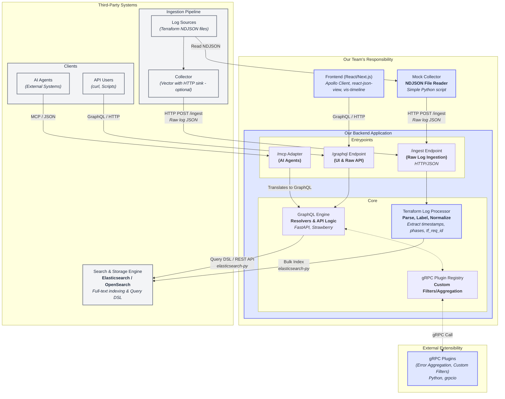
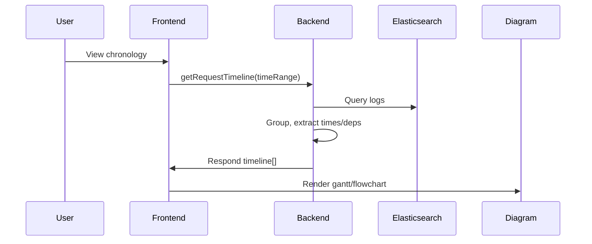

# Terraform LogViewer Project Specification

Terraform LogViewer is a web service designed for ingestion, parsing, searching, and analysis of Terraform JSON logs. It provides a unified interface to identify anomalies, trace execution chains, and analyze complex JSON request/response bodies from Terraform plan and apply logs. Kibana clone.

## Architecture



## Technology Stack

| Layer               | Technology / Library            | Notes                                             |
| ------------------- | ------------------------------- | ------------------------------------------------- |
| Backend Framework   | FastAPI + Uvicorn               | Async web framework, minimal boilerplate          |
| GraphQL Server      | Strawberry                      | Easy FastAPI integration, async GraphQL resolvers |
| Search Engine       | Elasticsearch (OpenSearch fork) | Industry standard for log search and analytics    |
| Data Validation     | Pydantic                        | JSON parsing and validation in FastAPI            |
| HTTP Client         | httpx                           | Async HTTP requests for plugins/mock collector    |
| Frontend            | React + Next.js                 | SPA with SSR and routing                          |
| GraphQL Client      | Apollo Client                   | Query caching and state management                |
| JSON Viewer         | react-json-view                 | Interactive expandable JSON tree                  |
| UI Component Lib    | Chakra UI or Material UI        | Accessible, fast development UI components        |
| Charting            | react-chartjs-2 + Chart.js      | Bar, pie, line charts                             |
| Timeline/Flowcharts | vis-timeline / react-flow       | Interactive Gantt or flowchart visualization      |

## Files and Folders

```
terraform-logviewer/
├── backend/
│   ├── app/
│   │   ├── main.py                  # FastAPI app entrypoint
│   │   ├── gql_schema.py            # Strawberry GraphQL schema and resolvers
│   │   ├── log_processor.py         # Terraform log parsing, labeling logic
│   │   ├── plugins.py               # gRPC plugin registry and interface definition
│   │   ├── ingest.py                # /ingest HTTP endpoint implementation
│   │   └── models.py                # Pydantic models for logs and requests
│   ├── Dockerfile                  # Backend container definition
│   └── requirements.txt            # Python dependencies
├── frontend/
│   ├── components/
│   │   ├── SearchBar.js            # Lucene search input
│   │   ├── LogList.js              # Log display with grouping by tf_req_id
│   │   ├── JsonViewer.js           # Expandable JSON component (react-json-view)
│   │   ├── GanttChart.js           # Gantt/flowchart visualization
│   │   └── MarkAsReadToggle.js     # UI component for "mark as read" feature
│   ├── pages/
│   │   ├── index.js                # Main frontend page with Apollo hooks
│   │   └── _app.js                 # Next.js app wrapper for providers
│   ├── package.json               # npm dependencies
│   └── Dockerfile                 # Frontend container
├── mock-collector/
│   ├── collector.py               # Simple Python script to push NDJSON logs to backend
│   └── requirements.txt
├── docker-compose.yml             # Compose config for local deployment
├── README.md                     # Project overview and setup instructions
└── docs/
    ├── architecture.md            # Detailed architecture explanation
    ├── gql_schema.md              # GraphQL schema documentation
    └── presentation.md            # Presentation slides outline & notes
```

## Development Plan

### Phase 1 - Foundation (Log Ingestion & Basic Search)

- Setup Docker Compose with Elasticsearch, backend, frontend, and mock collector
- Implement `/ingest` HTTP endpoint to accept raw NDJSON logs
- Develop Terraform Log Processor module to:
  - Extract and normalize timestamps and log levels
  - Detect and label `terraform plan` and `terraform apply` boundaries
  - Extract JSON blocks from `tf_http_req_body` and `tf_http_res_body`
- Simple frontend with search bar and raw log list display
- Backend GraphQL: basic `searchLogs(kql, timeRange)` resolver passing Lucene to ES
- Demo: Ingest sample NDJSON via mock collector, show logs in UI

### Phase 2 - Core Features (Advanced Search and UI)

- Enhance GraphQL schema for multi-field search and grouping by `tf_req_id`
- Implement expandable/collapsible JSON blocks in UI
- Add "mark as read" feature to exclude logs from anomalies
- Add GraphQL resolvers for aggregations and filtering by resource type
- Implement OTLP ingestion endpoint (optional advanced)
- Demo: Search/filter logs with multi-field and date range, expand JSON bodies interactively

### Phase 3 - Extensibility and Visualization

- Develop gRPC plugin registry and interface; implement at least one filtering plugin (e.g., error aggregation)
- Implement `/mcp` adapter endpoint for AI agent integration
- Build Gantt chart or flowchart visualization of request chronology with dependencies
- Demo: Visualize request/response timeline, call plugins, export filtered logs via API or curl

## Component Deep Dive

### Search & Analytics Engine

**Decision**: Elasticsearch (or OpenSearch)

**Reasoning**: Industry standard for full-text log search and analytics. Its powerful Query DSL and aggregation framework are ideal for Kibana-like features. Superior to alternatives like ClickHouse for unstructured text search.

**Setup**: Deploy using official Docker image with docker-compose.yml for easy setup.

### Ingestion Pipeline

**Decision**: Raw HTTP ingestion with optional OTLP support

**Flow**: Log-producing applications write to files. A collector agent (Vector, OTel Collector) tails these files and sends data to backend's `/ingest` endpoint.

**Backend Tasks**:
- Implement HTTP endpoint for raw log ingestion
- Optional: Implement gRPC server endpoint for OTLP log data
- Libraries: grpcio and opentelemetry-python for OTLP support

### Backend Application

**Stack**: Python with FastAPI and Uvicorn

**Primary API**: GraphQL using Strawberry

**Reasoning**: Complex UI requires data for multiple components simultaneously. GraphQL allows single, efficient requests vs multiple REST endpoints. Simplifies frontend state management and reduces network overhead.

**Internal Modules**:
- **GraphQL Engine**: Define schema and implement resolver functions that translate GraphQL queries to Elasticsearch Query DSL
- **API Entrypoints**: `/graphql` for frontend/API users, `/ingest` for log ingestion, `/mcp` adapter for AI agents
- **Extensibility**: gRPC plugins for custom filtering and aggregation services

### Frontend Application

**Stack**: React / Next.js with Apollo Client

**Key Features**:
- **Search Bar**: Lucene input passed directly to backend without frontend parsing
- **Visualizations**: Chart.js for reactive bar/line/pie charts from GraphQL aggregations
- **Trace/Waterfall View**: Gantt charts for OTLP span/trace visualization

## GraphQL & Elasticsearch Integration

### Data Storage and Querying

Elasticsearch stores each log line as a raw JSON document with dynamic field mapping. Core fields (`timestamp`, `phase`, `level`, `tf_req_id`) have explicit mappings while extra fields are handled automatically.

```json
{
  "mappings": {
    "properties": {
      "timestamp": { "type": "date" },
      "phase": { "type": "keyword" },
      "level": { "type": "keyword" },
      "tf_req_id": { "type": "keyword" }
    }
  }
}
```

### Search Resolver Implementation

```python
@strawberry.field
async def search_logs(self, kql: str = "", phase: str = None, limit: int = 100) -> SearchResult:
    es_query = {"query": {"query_string": {"query": kql or "*"}}}
    if phase:
        es_query = {
            "query": {
                "bool": {
                    "must": [
                        {"query_string": {"query": kql}},
                        {"term": {"phase": phase}}
                    ]
                }
            }
        }
    resp = await es_client.search(index="terraform-logs", body=es_query, size=limit)
    logs = [LogRecord(**hit["_source"]) for hit in resp["hits"]["hits"]]
    return SearchResult(total=resp["hits"]["total"]["value"], records=logs)
```

### Aggregations for Analytics

Aggregations enable grouping and counting (SQL-like `GROUP BY`) for charts and statistics:

```python
@strawberry.field
async def aggregate_errors(self, start: datetime, end: datetime) -> AggregationResult:
    q = {"query": {"range": {"timestamp": {"gte": start, "lte": end}}},
         "aggs": {"levels": {"terms": {"field": "level"}}}}
    resp = await es_client.search(index="terraform-logs", body=q, size=0)
    buckets = [AggregationBucket(key=b["key"], count=b["doc_count"])
               for b in resp["aggregations"]["levels"]["buckets"]]
    return AggregationResult(buckets=buckets)
```

### Request Chronology Visualization

**Algorithm**:
1. Query logs by time range/group (`tf_req_id`)
2. Extract start/end timestamps for each request chain
3. Identify dependencies from resource references
4. Generate timeline data for Gantt/flowchart rendering

```json
[
  { "id": "req1", "label": "Plan", "start": "...", "end": "...", "dependencies": [] },
  { "id": "req2", "label": "Apply", "start": "...", "end": "...", "dependencies": ["req1"] }
]
```


